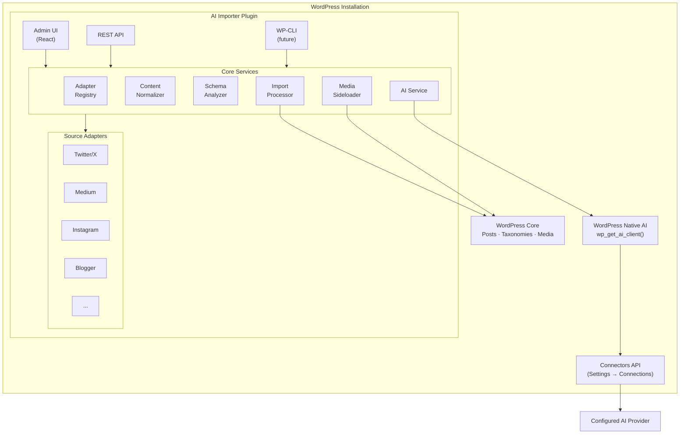
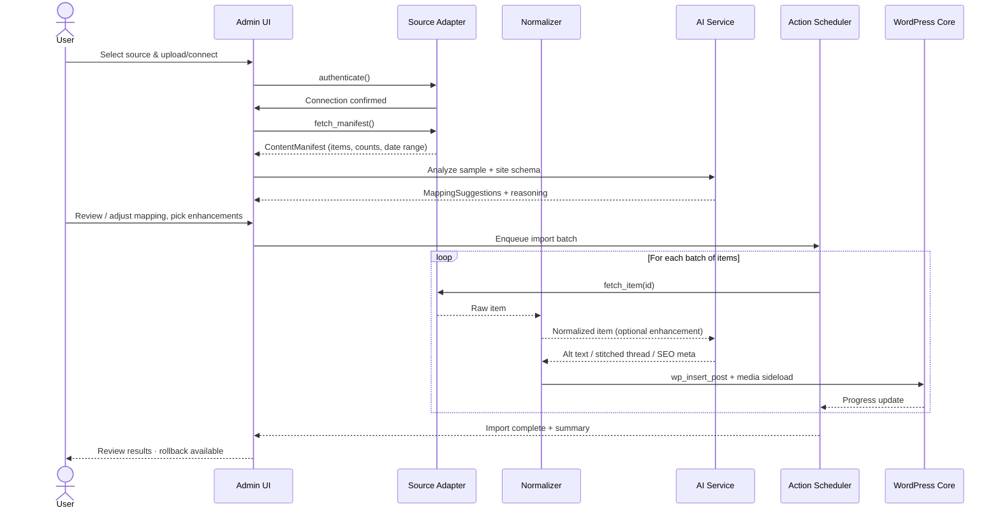
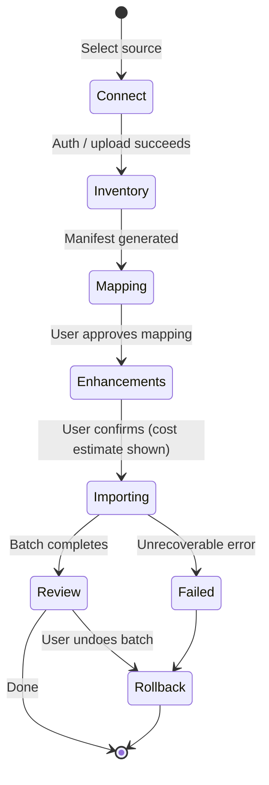

# AI Importer

> Make WordPress the universal home for all your content.

**AI Importer** is a WordPress plugin that migrates content from social media platforms and content repositories (Twitter/X, Instagram, Medium, Blogger, Tumblr, and more) into WordPress — using AI to intelligently analyze, map, and enhance your content along the way.

- **Status:** Alpha (v0.1.0)
- **Requires:** WordPress 7.0+, PHP 8.1+
- **License:** GPL-2.0-or-later

---

## What it is

AI Importer is a universal content migration tool for WordPress. Connect a source (via OAuth, API key, or file upload), review an AI-generated mapping of how your content will land in WordPress, and run a background import that preserves dates, media, and relationships.

The plugin uses the native WordPress AI capabilities introduced in WordPress 7.0 (`wp_get_ai_client()`). AI provider configuration is managed by core's [Connectors API](https://make.wordpress.org/core/2026/03/18/introducing-the-connectors-api-in-wordpress-7-0/) under **Settings → Connections** — AI Importer never asks for or stores API keys itself. Where AI requests are sent (and whether they leave your site at all) is determined entirely by the connector your administrator selects in core.

### Key capabilities

- **Universal adapters** — one consistent flow for Twitter/X, Medium, Instagram, Blogger, Tumblr (MVP), with more platforms on the roadmap.
- **AI-suggested mapping** — the plugin inspects your site's post types, taxonomies, and custom fields and proposes how source content should be structured.
- **Content enhancement** — optionally generate alt text, stitch Twitter threads into cohesive articles, create SEO meta descriptions, and clean up platform-specific cruft.
- **Safe imports** — Action Scheduler handles large imports in the background, every post is tagged with a batch ID so you can roll back, and originals are never deleted.
- **WordPress-native** — imports create proper block-based posts, use the Media Library, respect CPTs and taxonomies, and work with any theme.

---

## Why it exists

Years of writing, photos, and threads live scattered across platforms you don't own. Existing importers are platform-specific, manual, and often produce broken results: awkward posts, split threads, missing images, wrong dates.

AI Importer exists to solve three problems at once:

1. **Ownership** — consolidate content onto a domain *you* control, safe from platform policy changes.
2. **Quality** — use AI to transform platform-native formats (e.g. tweet threads) into well-structured WordPress posts rather than a dump of raw rows.
3. **Discoverability** — bring social content into your site's search and SEO surface area.

See [`ai-importer-prd.md`](./ai-importer-prd.md) for the full product vision, personas, and roadmap.

---

## How it works

### High-level architecture



### Data flow: from source to published post



### Import lifecycle



### End-to-end user flow


---

## Getting started

### Prerequisites

- WordPress **7.0 or later** (the plugin uses `wp_get_ai_client()` from core)
- PHP **8.1 or later**
- An AI connection configured in **Settings → Connections** (the WordPress Connectors API handles provider choice, credentials, and routing)

### Install for development

```bash
git clone https://github.com/adamsilverstein/ai-importer.git
cd ai-importer

composer install
npm install
npm run build
```

Then activate **AI Importer** from the WordPress admin. The plugin menu appears as **AI Importer** in the sidebar.

### Development commands

```bash
npm run start          # Watch mode for admin UI assets
npm run build          # Production build
npm run test           # JavaScript unit tests
npm run test:e2e       # Playwright E2E tests

composer run lint      # PHP_CodeSniffer (WordPress Coding Standards)
composer run test      # PHPUnit
./vendor/bin/phpunit --filter TestClassName   # Single test
```

---

## Project layout

```
ai-importer/
├── ai-importer.php          # Plugin bootstrap
├── includes/
│   ├── adapters/            # Per-platform source adapters
│   ├── normalizer/          # Universal content schema transforms
│   ├── schema/              # Destination site introspection
│   ├── ai/                  # wp_get_ai_client() wrapper
│   └── processor/           # Action Scheduler import pipeline
├── src/                     # React admin UI (@wordpress/scripts)
├── build/                   # Compiled assets
├── tests/                   # PHPUnit + Playwright tests
└── ai-importer-prd.md       # Product requirements
```

### Adapter contract

Every source adapter implements the same interface, which is what makes the flow universal:

| Method | Purpose |
|---|---|
| `authenticate()` | Connect via OAuth, API key, or file upload |
| `fetch_manifest()` | Return an inventory of available content |
| `fetch_item($id)` | Retrieve a single content item |
| `get_settings_schema()` | Describe adapter-specific options |

### Post meta added on import

Each imported post is tagged for traceability and rollback:

| Meta key | Purpose |
|---|---|
| `_ai_importer_source` | Adapter ID (e.g. `twitter`) |
| `_ai_importer_source_id` | Original platform ID |
| `_ai_importer_batch_id` | UUID grouping the import run |
| `_ai_importer_original_url` | Link back to the source |

---

## Roadmap

- **v1.0 (MVP):** Twitter/X, Medium, Instagram, Blogger, Tumblr; core AI enhancements; rollback.
- **v1.1:** YouTube, Substack, Ghost; SEO meta generation; incremental/delta imports; import history.
- **v2.0+:** TikTok, Notion, LinkedIn, Mastodon, Reddit; REST API; WP-CLI commands; custom adapter SDK.

See the [PRD](./ai-importer-prd.md) for the detailed feature matrix.

---

## Contributing

Issues and pull requests are welcome at <https://github.com/adamsilverstein/ai-importer>. Please follow the WordPress Coding Standards (`composer run lint`) and include tests for new behavior.

## License

GPL-2.0-or-later. See plugin header for details.
